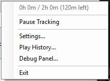
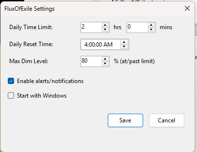
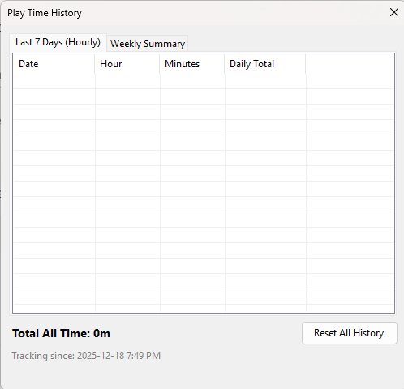

# FluxOfExile

A Windows app to help manage your Path of Exile playtime. Tracks time when PoE is focused, dims the game window as you approach your daily limit, and sends notifications.

## Features

- Tracks time spent in Path of Exile 1 and 2 (combined)
- Only counts time when the game window is focused
- Auto-pauses after 10 seconds of inactivity
- Gradual screen dimming starts 45 minutes before your limit
- Status notification on every game launch (with 10-minute cooldown)
- Notifications at hourly intervals, 30 min, 15 min, and when limit is reached
- Overtime alerts every 30 minutes past your limit
- Play history with daily and weekly views (edit and delete records)
- Pause tracking when needed
- Crash-resistant saves with automatic backups

## Installation

### Windows Installer (Recommended)
Download `FluxOfExile-Setup.exe` from the [latest release](https://github.com/null77/FluxOfExile/releases).

### Portable
Download `FluxOfExile.zip` from the [latest release](https://github.com/null77/FluxOfExile/releases), extract, and run.

### Build from Source
1. Install [.NET 10 SDK](https://dotnet.microsoft.com/download/dotnet/10.0)
2. Build and run:
   ```
   dotnet build
   dotnet run --project src/FluxOfExile
   ```

## Usage

The app runs in the system tray.


Right-click the tray icon to access:



- **Status** - Shows current playtime and remaining time
- **Pause/Resume Tracking** - Temporarily stop tracking
- **Settings** - Configure daily limit, reset time, max dim level
- **Play History** - View hourly and weekly playtime stats
- **Debug Panel** - Test dimming and notifications

### Settings



- **Daily Time Limit** - Hours and minutes allowed per day
- **Daily Reset Time** - When the daily counter resets (default 4:00 AM)
- **Max Dim Level** - How dark the screen gets at/past limit (0-100%)
- **Enable Alerts** - Toggle notifications on/off

### Play History



- **Last 7 Days** - Shows daily playtime totals (days based on reset time)
- **Weekly Summary** - Hours played per week and days active
- **Total All Time** - Cumulative playtime since tracking began
- **Edit/Delete** - Modify or remove daily records (double-click, right-click, or keyboard shortcuts)
- **Reset All History** - Clear all historical data

## How It Works

1. App detects when Path of Exile or Path of Exile 2 window is focused
2. Time accumulates while focused, pauses when alt-tabbed or minimized
3. Auto-pauses after 10 seconds of no keyboard/mouse input
4. Starting 45 minutes before your limit, the game window gradually dims
5. Dimming increases smoothly from 0% to your configured max
6. At/past the limit, dimming stays at max until daily reset

## Files

Settings and history are stored in `%LOCALAPPDATA%\FluxOfExile\`:
- `settings.json` - User preferences
- `state.json` - Current session state
- `history.json` - Playtime history
- `*.bak` - Automatic backups (used for crash recovery)
